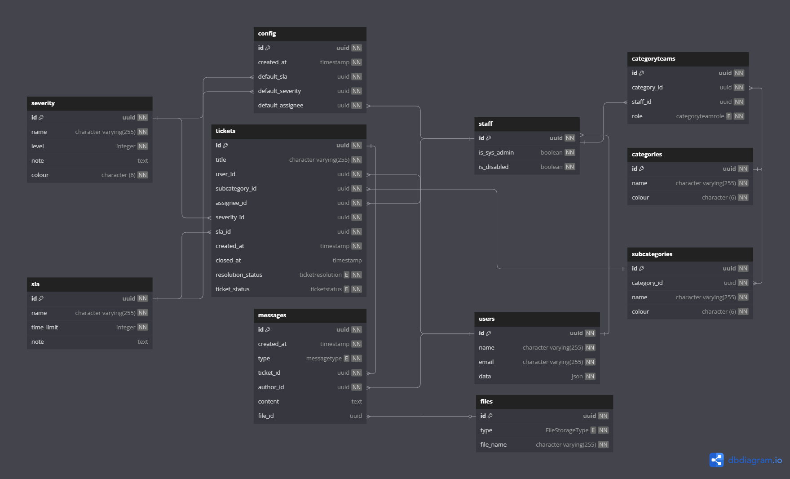

# ycn.club helpdesk (api)


A complete end-to-end HelpDesk system for institutes; allowing both students and faculty to act as users while utilizing dynamic categories/subcategories, SLAs, assignees, etc. Build with [Python](https://www.python.org/) using the [Sanic Framework](https://sanic.dev/en/).

> ⚠️ **Note:** This repository has been archived and will no longer receive updates. For further information on the project's status and brand identity, please refer to the [organization's README](https://github.com/orgs/YCN-club).

## History

This project started off as a complete HelpDesk system specifically for the T.A. Pai Institute of Management, Bengaluru. Unfortunately, due to resource constraints and policy conflicts from the Manipal Academy of Higher Education, the student project was archived with the hard work of the team members left undeployed.

While we work towards more generic solutions that can be adopted by other communities, this repository has been transferred to YCN (our _other_ project) and archived for documentation purposes. For more information on the state of the project, please refer to the [organization's README](https://github.com/orgs/YCN-club).

## Product Demo

Details about the UI and demo can be found in the [Helpdesk Frontend](https://github.com/YCN-club/helpdesk-website/) repository.

## Configuration

All core config. values of the HelpDesk system exist as enviroment variables, a sample ENV file can be found at [`.env-example`](.env-example).

## Database Schema

The database schema for the HelpDesk system can be visualized using the following diagram:



## Development

1. Install the dependency manager:

   ```bash
   pip install poetry
   ```

2. Install the dependencies:

   ```bash
   poetry install
   ```

3. Configure the environment variables:

   ```bash
   cp .env-example .env
   ```

4. Generate an RSA keypair:

   ```bash
   openssl genrsa -out private.pem 2048
   openssl rsa -in private.pem -pubout -out public.pem
   ```

5. Run the development server:

   ```bash
    poetry run task server
    ```

The project is now ready for development!
